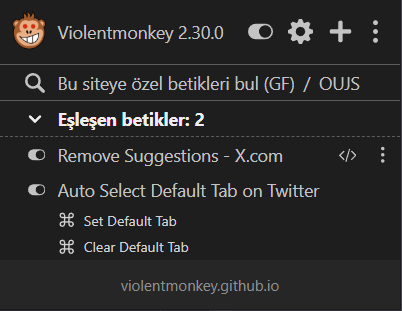
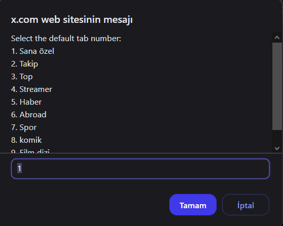

# Tampermonkey Userscripts Collection

This repository contains a collection of useful Tampermonkey/Violentmonkey userscripts to enhance your browsing experience.

## Scripts

### 1. Auto Select Default Tab on Twitter

A userscript that automatically selects your preferred tab when Twitter/X.com homepage loads.

**Features:**

- Set a default tab (For You, Following, etc.)
- Automatically switches to your preferred tab on page load
- Easy configuration through the Tampermonkey menu
- Option to clear default tab setting

### 2. Remove Suggestions - X.com

Removes unwanted suggestion sections from X.com (formerly Twitter) to provide a cleaner browsing experience.

**Features:**

- Removes "Who to follow" section
- Removes "You might like" section
- Works with dynamically loaded content
- Provides a cleaner, distraction-free timeline

### 3. Memrise Seslendirme (Memrise Text-to-Speech)

Adds text-to-speech functionality for German words on Memrise.com.

**Features:**

- Automatically pronounces German words when they appear
- Click on words to hear them again
- Uses native browser text-to-speech capabilities
- Works on both learning and test cards

## Installation

1. First, install a userscript manager:

   - [Tampermonkey](https://www.tampermonkey.net/)
   - [Violentmonkey](https://violentmonkey.github.io/)

2. Install scripts directly by clicking the install buttons above, or:
   - Click on any of the script files in this repository
   - Click the "Raw" button
   - Your userscript manager should automatically detect the script and prompt you to install it

## Usage

Each script can be enabled/disabled through your userscript manager's menu. Some scripts may have additional configuration options available through the userscript manager's menu.

## Contributing

Feel free to submit issues, fork the repository, and create pull requests for any improvements.

## License

These userscripts are open source and available under the MIT License.
